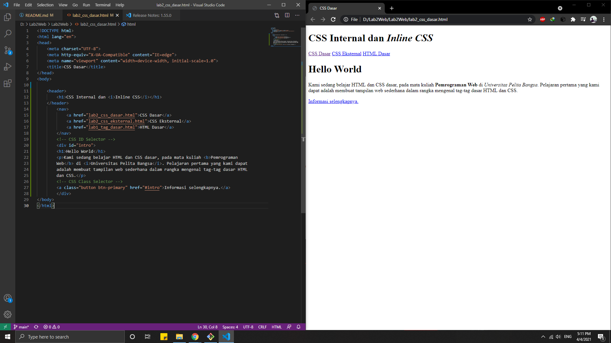
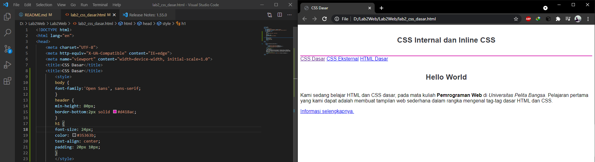
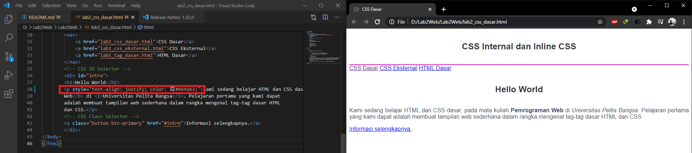
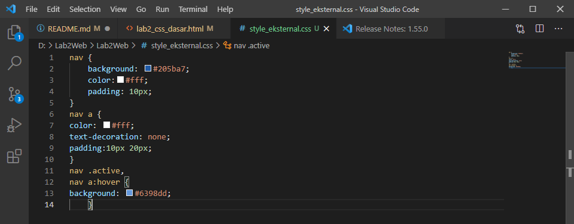
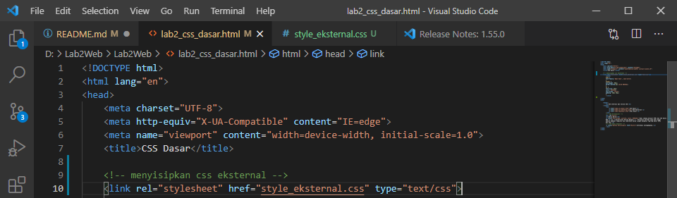
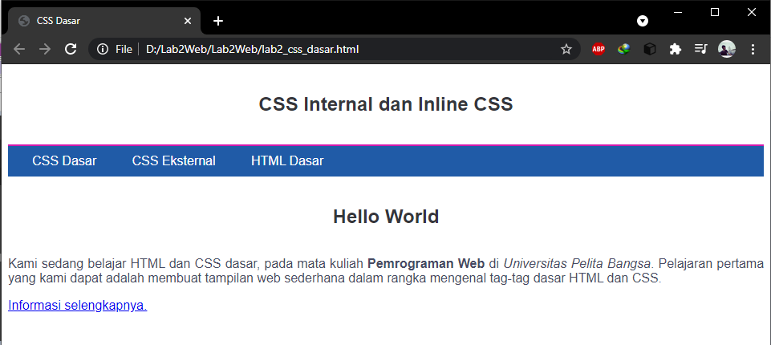
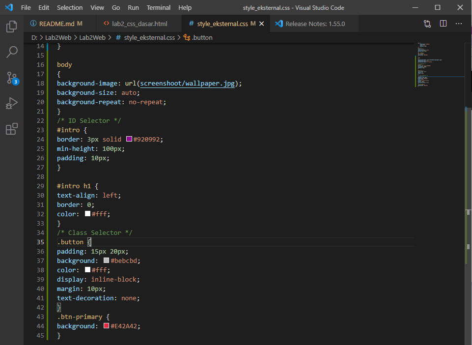
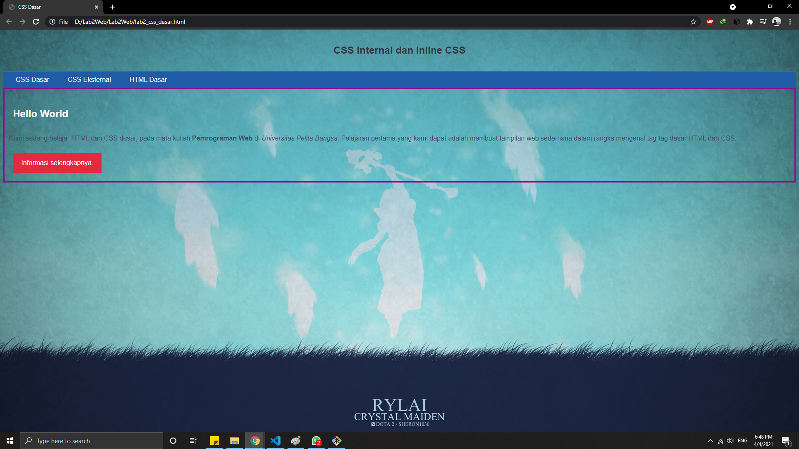

# Lab2Web

## Pemograman Web - Praktikum ke 2

### Langkah - Langkah Pembuatan
Memasukan tag HTML 5 dengan code seperti gambar di bawah ini

Ada berbagai macam cara untuk mendeklarasikan CSS pada HTM dan berikut ini adalah cara cara nya.

1. Deklarasi CSS internal pada bagian Head HTML

2. Deklarasi CSS Inline pada tag paragraf

3. Deklarasi CSS eksternal yang di hubungkan dengan link.
Pertama tama buatlah CSS Eskternal nya dan masukan Deklarasi nya.

Setelah itu hubungan file HTML dengan file CSS dengan cara memasukan tag link pada head seperti di bawah ini.

Dan untuk hasilnya seperti gambar dibawah ini.

4. Dan yang terakhir Mendeklarasikan CSS Menggunakan Selector.
Untuk kode nya seperti gambar dibawah ini, saya sedikit menambahkan background image agar lebih menarik pada tag body.

Dan hasil nya seperti gambar di bawah ini.
