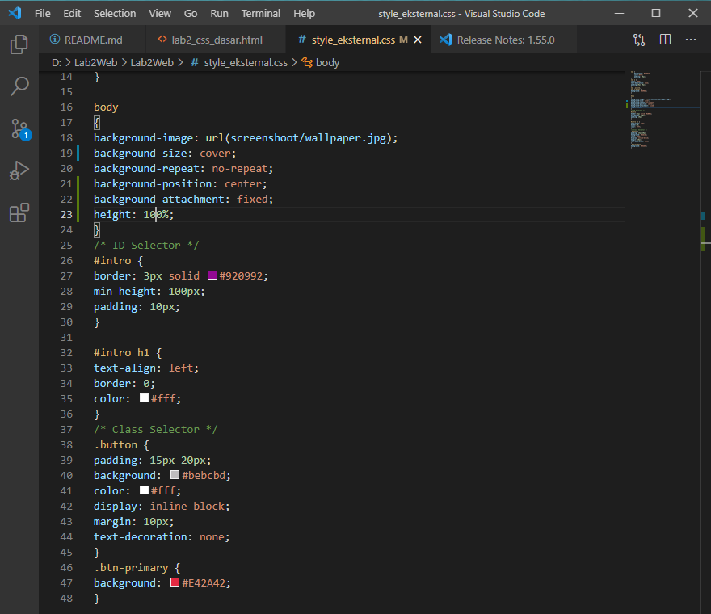
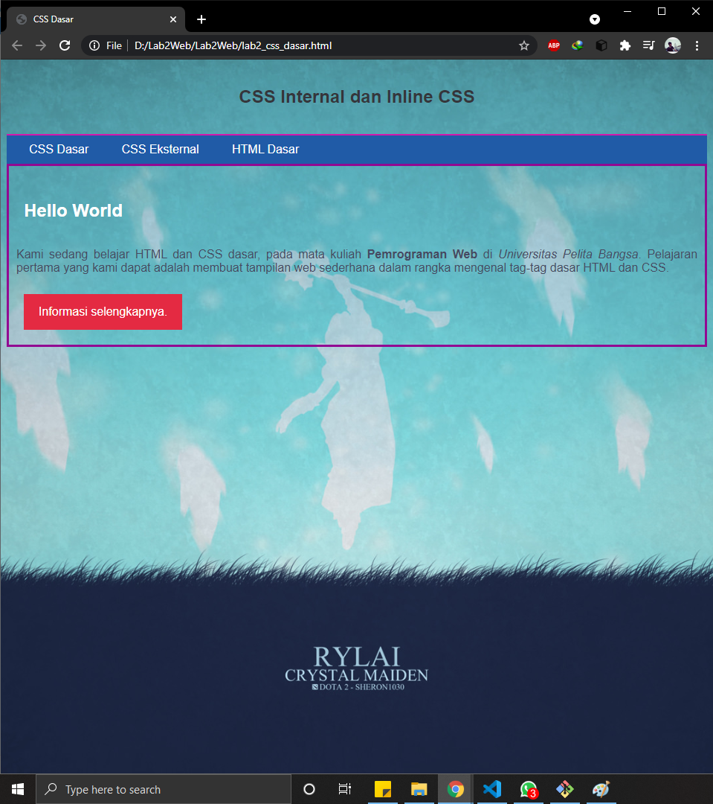

# Lab2Web

## Pemograman Web - Praktikum ke 2

### Langkah - Langkah Pembuatan
Memasukan tag HTML 5 dengan code seperti gambar di bawah ini

Ada berbagai macam cara untuk mendeklarasikan CSS pada HTM dan berikut ini adalah cara cara nya.

1. Deklarasi CSS internal pada bagian Head HTML

2. Deklarasi CSS Inline pada tag paragraf

3. Deklarasi CSS eksternal yang di hubungkan dengan link.
Pertama tama buatlah CSS Eskternal nya dan masukan Deklarasi nya.

Setelah itu hubungan file HTML dengan file CSS dengan cara memasukan tag link pada head seperti di bawah ini.

Dan untuk hasilnya seperti gambar dibawah ini.

4. Dan yang terakhir Mendeklarasikan CSS Menggunakan Selector.
Untuk kode nya seperti gambar dibawah ini, saya sedikit menambahkan background image agar lebih menarik pada tag body.

Dan hasil nya seperti gambar di bawah ini.

### Pertanyaan dan Tugas
1. Lakukan eksperimen dengan mengubah dan menambah properti dan nilai pada kode CSS dengan mengacu pada CSS Cheat Sheet yang diberikan pada file terpisah dari modul ini.
2. Apa perbedaan pendeklarasian CSS elemen h1 {...} dengan #intro h1 {...}? berikan penjelasannya!
3. Apabila ada deklarasi CSS secara internal, lalu ditambahkan CSS eksternal dan inline CSS pada elemen yang sama. Deklarasi manakah yang akan ditampilkan pada browser? Berikan penjelasan dan contohnya!
4. Pada sebuah elemen HTML terdapat ID dan Class, apabila masing-masing selector tersebut terdapat deklarasi CSS, maka deklarasi manakah yang akan ditampilkan pada browser? Berikan penjelasan dan contohnya! ( p id="paragraf-1" class="text-paragraf" )

#### Jawaban
1. Disni saya menggunakan atribut pada background yang membuat background img mengikuti ukuran dari lebar halaman browser.

Dan Hasil nya seperti ini.

2. h1 itu di gunakan untuk seluruh tag h1, sedangkan #intro h1 di gunakan untuk h1 yang memiliki id #intro

3. Yang akan tampil lebih dulu adalah CSS secara internal karena Perubahan hanya terjadi pada 1 halaman Class dan ID bisa digunakan oleh internal stylesheet Tidak perlu meng-upload beberapa file karena HTML dan CSS bisa digunakan di file yang sama. Jika CSS Eksternal Halaman belum tampil secara sempurna hingga file CSS selesai dipanggil. jika menggunakan Inline CSS sangat tidak direkomendasikan karena harus Inline CSS harus diterapkan pada setiap elemen walaupun sangat simpel untuk perbaikan cepat.

4. Perbedaan dari class dan id adalah kelebihan unggul dari class yaitu dapat diberikan pada banyak element html dan dapat dipanggil sekaligus sedangkan id hanya dapat bekerja pada satu penandaan saja, maksudnya satu nama id hanya bisa id berikan pada satu element.